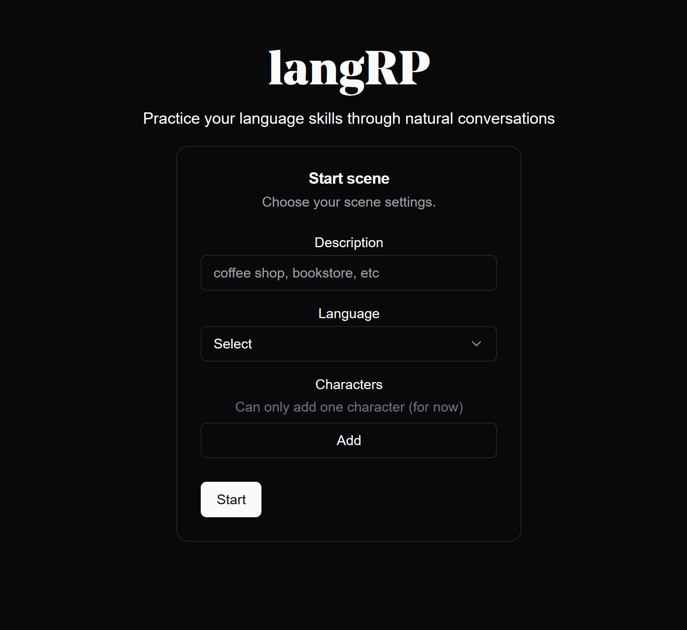

## langRP
#### Practice your target language with interesting characters in fun scenarios! 


### Setup
You can find this project at [langrp.vercel.app]()

But if you want to run it locally:

In the `.env` file, add the MISTRAL_API_KEY. By default, it uses the Mistral API but if you'd like to use your own LLM, simple change `LOCAL` to true and run that LLM on port 8000.

The project can be ran with Docker via:
```
docker-compose up
```

### Testing
Just do:
```
cd frontend
npm test
```

### FAQ
**Q. Why keep an entirely separate backend if all you're doing is use the Mistral API?**

Since we eventually plan to more fine-tuned LLMs (and potentially ageantic frameworks), it made sense to keep the backend processing all separate.
